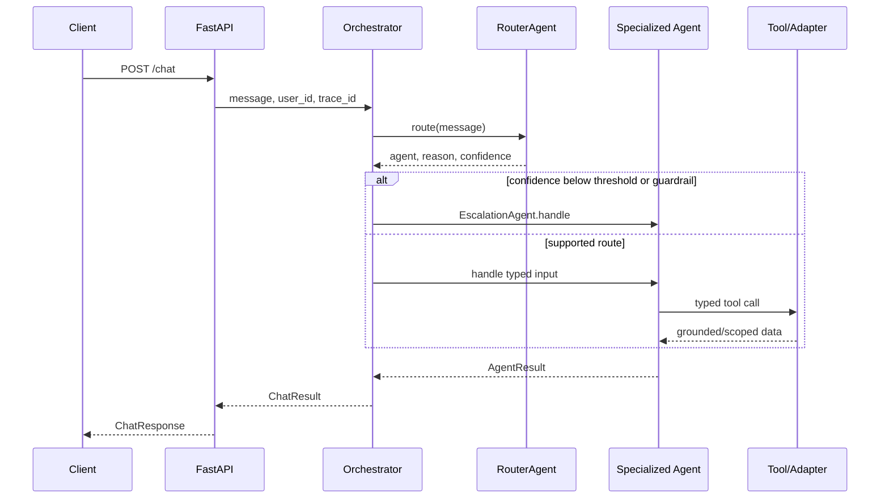

# Architecture

## Context

The service answers public Getnet product questions, current general-information questions, and a
small set of authenticated customer-support diagnostics. Its current downstreams are a local
Getnet index and fake customer repository. Production adapters would integrate search, CRM,
payments, settlement, and terminal systems.

## Layers

```text
src/getnet_support/
├── domain/        immutable business and evidence contracts
├── application/   agents, orchestration, and ports
├── adapters/      RAG, ingestion, tools, fake data, settings, telemetry
└── entrypoints/   FastAPI models, routes, logging, composition
```

### Domain

Framework-free values describe routing, agent output, sources, retrieval, profiles, transactions,
and terminal status. Monetary values use `Decimal`; timestamps are timezone-aware UTC.

### Application

`SupportOrchestrator` is the chat use case. It calls `RouterAgent` and exactly one specialized
agent. Protocol ports keep retrieval, search, customer data, and events replaceable. There is no
implicit global agent state.

### Adapters

The local TF-IDF retriever, bounded HTML ingestor, fake repository, scoped tools, settings, and
structured event sink implement application ports. Optional OpenTelemetry and Langfuse adapters
remain failure-isolated and disabled without configuration.

### Entrypoints

FastAPI validates external input and maps domain results to public Pydantic schemas. The module is
also the composition root that selects concrete adapters.

## Critical sequence



## Dependency rule

```text
entrypoints -> application -> domain
adapters    -> application/domain
domain      -> no outer layer
```

This is enforced by `scripts/validate_architecture.py` in the harness quality gate.

## Cross-cutting decisions

- Configuration: environment variables validated by Pydantic settings.
- Logging: metadata-only JSON events with request trace IDs.
- Tracing: optional OpenTelemetry over OTLP HTTP/protobuf; disabled by default.
- Errors: external ingestion failures are isolated; unsupported business requests escalate.
- Time: timezone-aware UTC internally.
- Money: `Decimal` in domain records.
- Idempotency: the current API exposes read-only behavior only.
- Packaging: multi-stage container, non-root runtime, Uvicorn entrypoint on port 8000.
- Security: customer data is tool-scoped by `user_id`; retrieved content is untrusted data.
