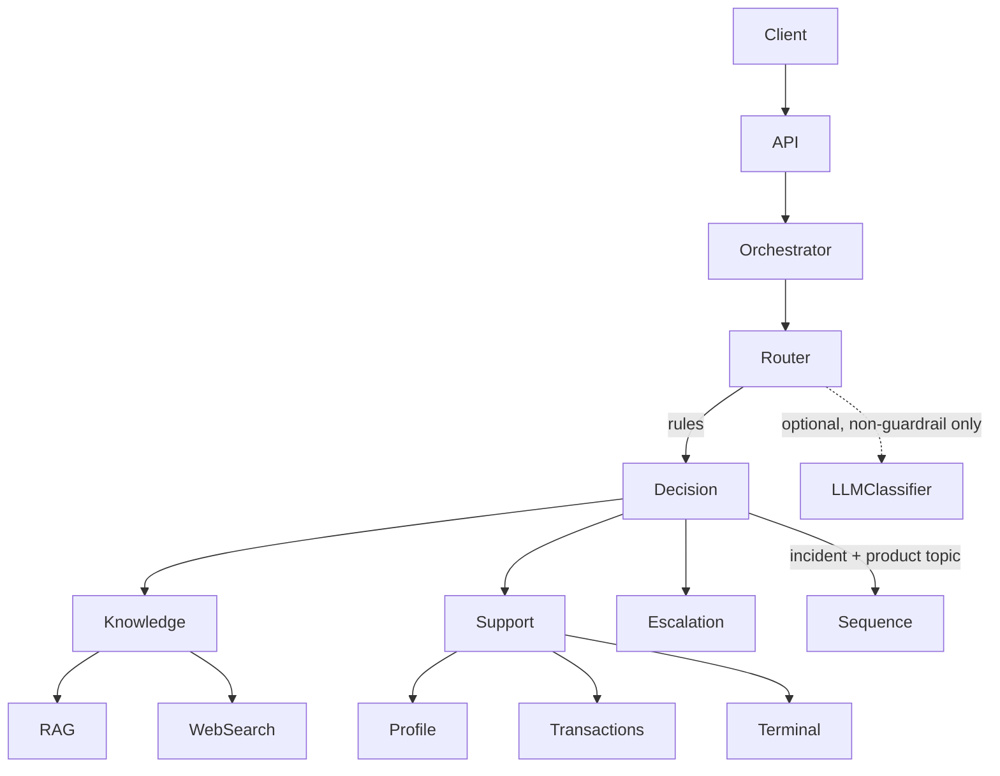

# Design 001 — Multi-agent Getnet support system

## Layering

```
entrypoints  FastAPI schemas, routes, composition root
application  agents, orchestration, typed ports, language catalogue
adapters     RAG index and ingestion, tools, providers, settings, telemetry
domain       immutable contracts, no framework imports
```

Dependencies point inward only; `scripts/validate_architecture.py` enforces it in CI (REQ-N3).

## Orchestration



The orchestrator is the only place that knows the agent graph. It emits `router_decision` before
executing anything, so a wrong route is diagnosable from logs alone without replaying the message
(REQ-O1).

## Router (REQ-R1..R7)

Two independent layers:

1. **Rule layer (default, always present).** Weighted `IntentRule` values with two matcher forms:
   token-prefix patterns (`conect*`, `travand*`) and co-occurrence groups (`all_of`). Co-occurrence
   is what makes paraphrase survive: a device term plus a fault term routes to support even for a
   sentence nobody anticipated. Phrase-only rules overfit to the exact examples in a brief.
2. **Classifier layer (optional).** `IntentClassifierPort` with an OpenAI structured-output adapter.
   It is consulted only when no guardrail fired (REQ-R5) and returns `None` on any failure, so the
   rule decision stands (REQ-R4).

Confidence is a documented monotonic heuristic (`score_to_confidence`), not a calibrated
probability. Calibration against the offline dataset is tracked in `docs/EVALUATION.md`.

**Sequence trigger (REQ-R6).** A sequence runs only when a support-incident rule fired *and* a
product-topic term is present. Score proximity alone is rejected as a trigger: "maquininha" is both
a device word and a product word, so a score-based rule would append marketing text to every
incident answer.

## Knowledge agent (REQ-K1..K5)

Two grounding gates, because lexical similarity alone is not relevance on a small corpus:

* score gate — `MINIMUM_RETRIEVAL_SCORE`;
* term-coverage gate — the chunk must actually mention the distinctive terms of the question.

The coverage gate exists because of an observed failure: a question about *crediário* installments
retrieved the *antecipação* article above the score gate and produced a confident, wrongly-cited
answer. A score threshold alone cannot separate "shares common Portuguese words" from "answers the
question".

Curated chunks (human-reviewed, source-attributed, bilingual) win near-ties against scraped chunks
so a page teaser does not outrank text that answers the question. `curated` is a retrieval-quality
flag only; every chunk stays untrusted data for prompt purposes (REQ-K4).

`GetnetKnowledgePort` is the seam for embeddings and a managed vector store.

## Corpus hygiene (REQ-K5)

Cleaning is structural, not a blocklist, so it survives a site redesign:

* text appearing on two or more canonical URLs is site chrome and is dropped;
* chunks containing a support phone number are contact chrome;
* chunks below a distinct-word floor carry no answer.

On the committed artifact this removed 19 of 41 chunks, all navigation and contact blocks that were
otherwise outranking product content.

## Customer support agent (REQ-S1..S3)

Three typed tools scoped by `user_id`: profile, recent transactions, terminal status. Tool
selection is signal-driven and reuses the router lexicons, so support and routing cannot drift
apart. No model is on this path.

## Language (REQ-L1)

`application/language.py` holds lexical detection plus a bilingual catalogue. Response text is not
inlined in agents, so adding a language is a catalogue change rather than an agent change.

## Security boundaries

* `user_id` is trusted only as a lookup key; production must derive it from an authenticated
  identity.
* Retrieved and external content is untrusted; the generation prompt states this explicitly.
* Logs carry metadata and a namespaced `user_reference_hash` (pseudonymization, not anonymization).
